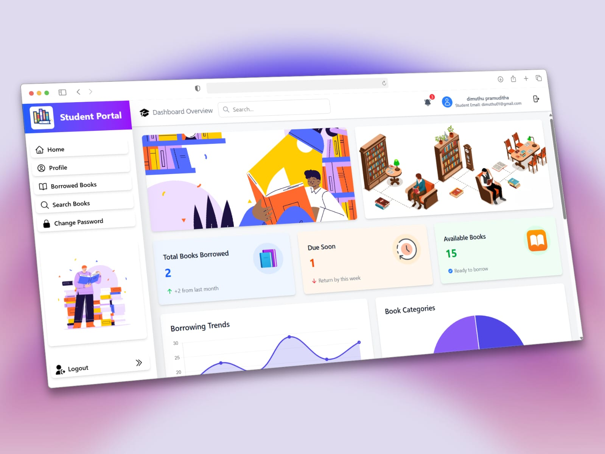

<div align="center">

# 📚 Library Management System
**A Modern Web-Based Solution for Digital Library Operations**

<div align="center">
  
</div>


[](https://php.net)
[](https://html.spec.whatwg.org/)
[](https://tailwindcss.com)
[](https://javascript.com)


---
</div>

## 🎯 Overview
The Library Management System is a comprehensive web application designed to streamline library operations across three distinct user roles. Built with modern web technologies, it provides an intuitive interface for managing books, users, and borrowing activities.

## ✨ Features 

<div>
  
  ## AI Book Summarizer Integration 
 
  
  The **AI Book Summarizer** is seamlessly integrated into the student dashboard, providing:

### ✨ Features:
- **📝 Intelligent Summaries**: Get concise book summaries instantly
- **🔍 Context-Aware Responses**: AI understands book context and user queries
- **💾 Chat History**: Save and review previous conversations
</div>

### 🎓 Student Portal
| Feature | Description |
|---------|-------------|
| **Book Search & Browse** | Fast and accurate catalogue search with advanced filters |
| **Borrowing Management** | Easy book borrowing and return processes |
| **Personal Dashboard** | View borrowing history, current loans, and due dates |
| **Notifications** | Receive alerts for due dates and library announcements |

### 👩‍💼 Librarian Portal
| Feature | Description |
|---------|-------------|
| **Book Management** | Add, update, remove, and categorize book records |
| **User Administration** | Manage student accounts and borrowing privileges |
| **Transaction Processing** | Handle book issuing and returning operations |
| **Records Maintenance** | Comprehensive borrowing history and overdue tracking |
| **Reporting Tools** | Generate reports on library usage and inventory |

### ⚙️ Admin Portal
| Feature | Description |
|---------|-------------|
| **System Oversight** | Monitor overall library system performance |
| **Staff Management** | Create and manage librarian accounts |
| **Configuration** | System settings and parameter adjustments |
| **Analytics Dashboard** | Advanced reporting and usage analytics |

---
## 📸 System Dashboards

### 🎓 Student Dashboard
<div align="center">

</div>

### 👩‍💼 Librarian Dashboard
<div align="center">

</div>

### ⚙️ Admin Dashboard
<div align="center">

</div>

<table>
<tr>
<td width="10%">

### 📋 PREREQUISITES CHECKLIST

```yaml
🔧 System Requirements:
  ├── 💻 Windows OS
  ├── 🌐 WAMP Server 3.0+
  ├── 🐘 PHP 7.4+
  ├── 🗄️ MySQL 5.7+
  ├── 🌍 Modern Web Browser
  └── 💾 500MB+ Storage
```

</td>
</tr>
</table>

## 📁 Project Architecture

```
📦 librarymanagementsystem/
├──  admin_dashboard.php             # Admin portal files
├── librarian_dashboard.php          # Librarian portal files  
├── student_dashboard.php            # Student portal files
├──  pages/ 
│   ├── index.css                    # Common CSS files
│   └── assets/                      # CSS files
├── 🔧 login.php                     # Login and authentication
├── 🔐 logout.php                    # Logout script
├── 📂 register.php                  # User registration
├── 📜 README.md                     # Project documentation
├── 🗄️ database/                     # Database files
|         |__ libraryms.sql          # Database connection script
├── config.php                       # Configuration files
└── 🏠 index.php                     # Main entry point
└──  admin.js                       # Admin-specific scripts
└──  librarian.js                    # Librarian-specific scripts
└──  main.js                        # Common scripts
```

### ⚡ Installation Steps


<b>Step 1: WAMP Server Setup</b>

```bash
# Download WAMP Server from official website
# 🌐 Visit: http://www.wampserver.com/
# 📥 Download and install WAMP64
# ▶️ Start WAMP Server
# 🟢 Wait for green icon (all services running)
```


<b>Step 2: Setup Project</b>

```bash
# 📋 Copy project to WAMP directory
# Default path: C:\wamp64\www\librarymanagementsystem\

# 🗄️ Setup Database
# 1. Open phpMyAdmin: http://localhost/phpmyadmin
# 2. Create database: libraryms
# 3. Import SQL file (if available)
```
### 3. Project Deployment
1. Copy the project folder to WAMP's `www` directory:
   ```
   C:\wamp64\www\librarymanagementsystem\
   ```
2. Ensure all files are properly placed in the directory

### 4. Configuration
1. Update database connection settings in `config/database.php`:
   ```php
   $host = "localhost";
   $username = "root";
   $password = "";
   $database = "libraryms";
   ```

## 🌐 Running the Application

1. Start WAMP Server
2. Open your web browser
3. Navigate to: `http://localhost/librarymanagementsystem/`
4. Use the appropriate login credentials for your role

## 🔐 Default Login Credentials

### Administrator Access
- **Email**: admin@gmail.com
- **Password**: password
- **Portal**: Admin Dashboard

### Librarian Access
- **Email**: librarian@gmail.com
- **Password**: 12345678
- **Portal**: Librarian Dashboard

### Student Access
- **Email**: student@gmail.com
- **Password**: 12345678
- **Portal**: Student Dashboard
---

##  Contributing 
<div align="center">


</div>

We love contributions! Here's how you can help:

1. 🍴 Fork the repository
2. 🌿 Create a feature branch (`git checkout -b feature`)
3. 💻 Commit your changes (`git commit -m 'Add some AmazingFeature'`)
4. 📤 Push to the branch (`git push origin feature`)
5. 🎉 Open a Pull Request

---

## 📧 Contact

<div align="center">

**DPramuditha**

[](https://github.com/DPramuditha)
[](mailto:your.email@example.com)

</div>

---

## 🌟 Show Your Support 

<div align="center">

If you like this project, please consider giving it a ⭐️ on GitHub!


**Made with ❤️ by DPramuditha** 


</div>

---
